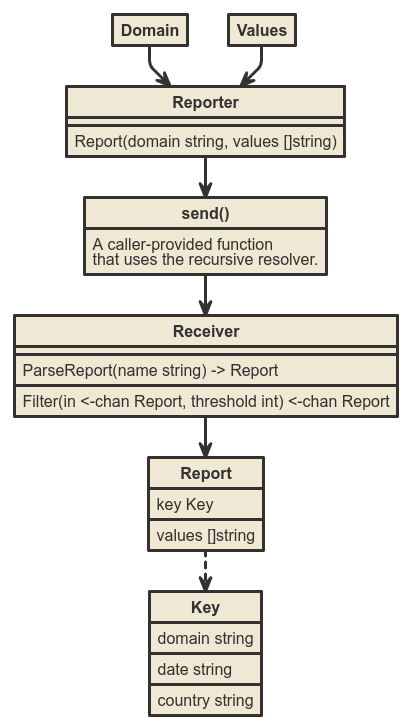
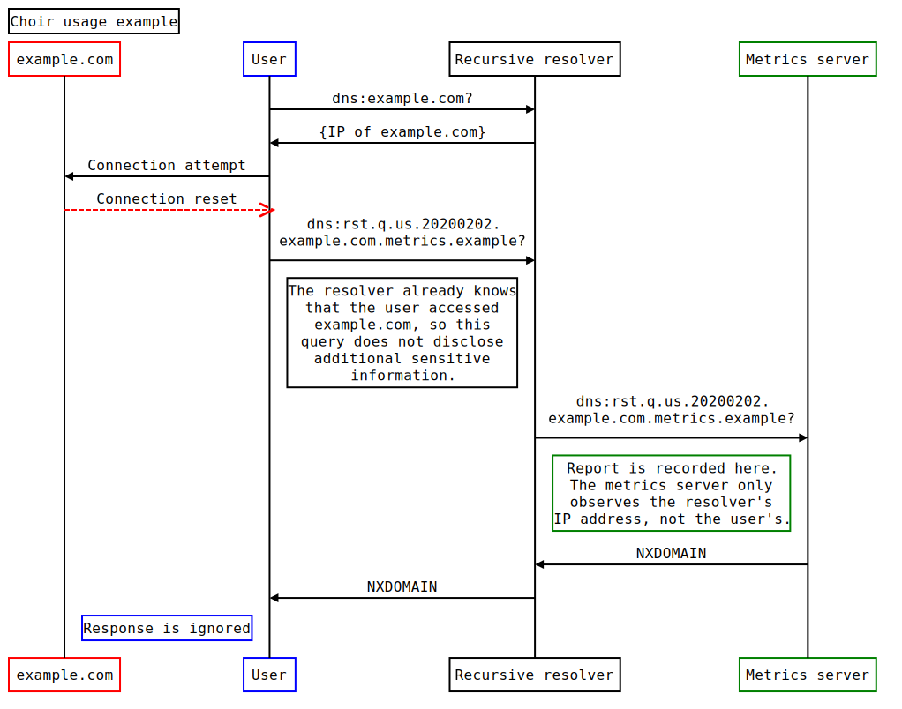

# Choir: Privacy-first framework for domain-oriented error reporting

## Overview

Choir is a Go library for reporting errors from apps without revealing the user's IP address to the developer.  It works by sending error reports through the user's DNS server, which acts as an anonymizing forwarder.  Choir is most appropriate when the error reports represent failure to connect to a particular domain.

The name "Choir" refers to hearing from many users without being able to identify them individually.

## Background and motivation

It is now common for networked client software to report performance and reliability problems to the developer.  This information can help the developer to troubleshoot problems encountered by users, and prioritize the most important improvements.  However, typical reporting systems require the user to place a significant amount of trust in the developer and their metrics service.  Even reporting frameworks that are described as "anonymous" often reveal the client's IP address to the service operator, requiring the client to trust that the operator is not storing or analyzing this information inappropriately.

To reduce the degree of trust they ask of their users, developers of privacy-oriented client software sometimes forgo error reporting entirely.  This avoids possession of potentially sensitive user data, but it also prevents developers from identifying and understanding issues with their products, resulting in a worse user experience.

In network security software, reports often contain a domain name along with some performance or reliability information about the connection to that domain.  In many cases, the domain name is the only sensitive aspect of the report, insofar as it may indicate a user action.  However, this information is necessarily already known to the user's DNS server (i.e. recursive resolver), which the client used to bootstrap the connection.

Choir enables developers to receive domain-keyed reports without learning the client's IP address, by sending reports through the client's DNS server.

## Domain names and _k_-anonymity

If we suppose that the software developer can receive reports from a user without learning their IP address, there is still a potential concern related to domain names that are only accessed by a very small number of users, especially if the developer would like to share aggregated data with third parties.  For example, a single report for a domain like "firstname.lastname.bloghost.example" might indicate that the person by this name is keeping a secret diary.  If the developer shares a list of domains that includes this name, the existence of the secret diary is revealed.

To help developers protect the privacy of their users when sharing aggregated information, we need to provide a reliable way for the developers to determine whether a domain was used by many different users.  Counting the number of reports is not sufficient: a single user could have produced multiple reports, and reports can be duplicated by DNS intermediaries.

Choir is designed to give developers a lower bound on the number of distinct users reporting a particular domain, while also ensuring that multiple reports cannot be tied to a single user.

## Design

Choir is a highly opinionated reporting library, designed to guide developers toward good privacy practices.  Each Choir report consists of a _key_ and zero or more _values_.  The key is a tuple of `(domain name, country code, UTC date)`.  The values are arbitrary strings.

Choir assigns each outgoing report to one of a configurable number of _bins_.  The assignment is random but stable for each (key, user) pair, based on a hash with a secret, static salt.  If the developer observes the same key in _k_ different bins, they can be confident that it was reported by at least _k_ distinct users.  Otherwise, developers should not share this domain with third parties.  The date is included in the key to ensure that bin assignments cannot be used to track a user over multiple days.

Choir reports are converted into domain names in the following format

```
value0.value1.value2.bin.us.20191218.www.example.com.metrics.mydomain.example
```

The Choir library guides applications to
* limit reports to one per domain per day,
* construct reports with appropriate pseudorandom bin assignments,
* convert reports into domain names,
* format queries for these names with client subnet reporting disabled, and
* rate-limit queries to avoid sending correlated reports.

For the metrics server, Choir provides tools for
* parsing reports from domain names, and
* applying _k_-anonymity filtering to the received reports.

### Rate limiting

Choir imposes two kinds of rate limits to minimize information leakage.  First, each domain can only be the subject of one report per day.  Without this limitation, if a single client produced multiple reports for the same domain, they would be assigned to the same bin, potentially allowing the developer to link the reports together.

Secondly, when a burst of reports are filed in a short interval (the "burst duration"), Choir will select one at random to report and discard the rest.  This avoids reporting patterns of domains that could reveal additional information about user activity, such as a specific webpage that they were visiting.

To avoid creating persistent state that records user activity, these limits are implemented purely in-memory.

## Implementation

Each report to the metrics server is represented as a `Report`, which has a `Key` (consisting of the domain, country, and date) and a slice of `string` values.  To create and send reports, clients first instantiate a long-lived `Reporter`, which is configured with the number of values, number of bins, user country, burst duration, and a callback to use for sending queries.

Servers use a `Receiver` to parse incoming DNS queries into `Report`s, and to apply _k_-anonymity filtering to those reports based on the number of bins.



## Example

This diagram shows an example of using Choir to report connection errors, with a single value indicating the type of error.



## Advice and Warnings

* The values have not previously been revealed to the recursive resolver, so developers must be confident that they are non-sensitive.  To give users confidence that Choir is being used responsibly, developers are encouraged to make values human-readable or extremely compact.  Each value must be lowercase ASCII and short enough to fit in a DNS label.
* The salt must be preserved as long as possible on the client.  Changes to the salt could cause a user to be double-counted, undermining the _k_-anonymity guarantee.
* Developers can configure the number of bins.  A larger number of bins allows the server to enforce a larger anonymity threshold, but also makes repeated reports from a single user during a single day easier to link if duplicate detection fails.
* Developers are encouraged to set a burst duration of at least five seconds, to cover the load duration of a typical webpage.
